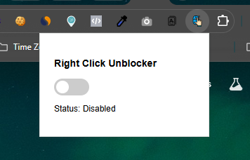
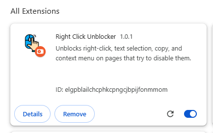
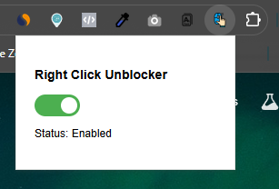

# Right Click Unblocker - Extension

Right Click Unblocker is a lightweight Chrome Extension that unblock your ability to **right-click, select text, copy, paste, and open context menus** on websites that block these actions.

---

## 🚀 Features
- Enable right-click context menus on blocked sites  
- Allow text selection and copying where disabled  
- Restore cut, copy, paste, drag & select functions  
- Simple toggle ON/OFF from popup  
- Lightweight and fast (Manifest V3)  

## 📦 Installation
Download or clone this repository: `right-click-unblocker`
- Open Chrome and go to chrome://extensions/
- Enable Developer mode (top-right corner)
- Click Load unpacked and select this project folder
- The extension will appear in your browser toolbar 🎉

## 🖼️ Screenshots

## ⚙️ Tech Info
- Manifest Version: 3
- Permissions: storage
- Content Script: Runs on all sites `<all_urls>`
- Popup: popup.html with toggle switch

## ⚙️ Compatibility
Works with all Chromium-based browsers, tested on:
- Google Chrome
- Brave
- Microsoft Edge
- Vivaldi

## 📌 Notes
Works on most websites that try to block right-click or text selection
May not work on some advanced web apps with deeply integrated protections
